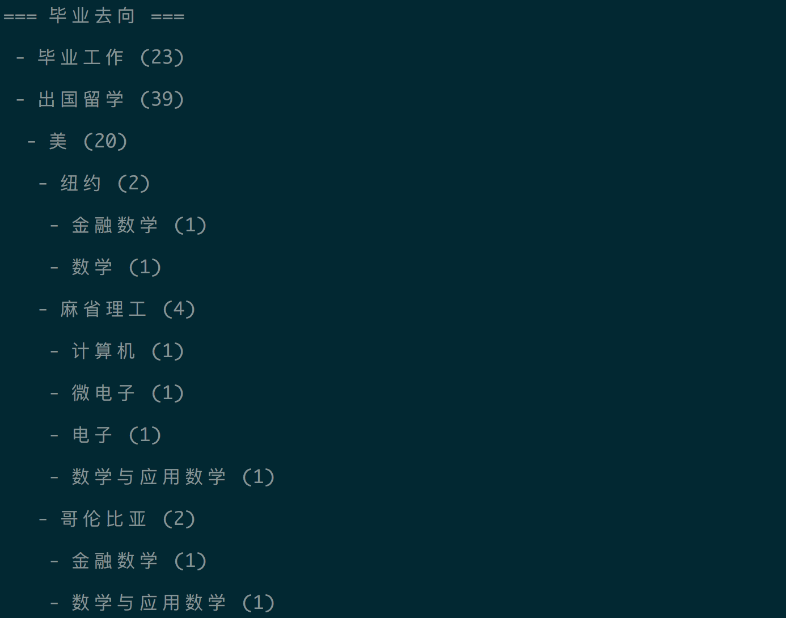
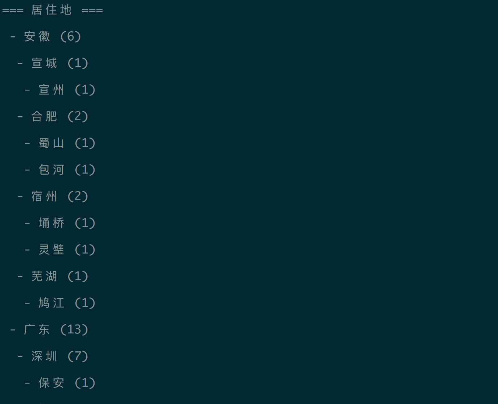

# Project报告

## 小组成员及分工

## 主程序说明和使用方法

## 主要代码和思路

题目要求统计和学生相关的数据，因此我们先创建一个Student类，用来存放每个学生的数据，同时创建一个Statistics类，来放置各种统计方法，方便调用。

```python
# encoding=utf-8

class Student:
  '''
  Parameters:
    data - a dict contains the data of each student
  '''
  def __init__(self, data):
    self.id = data['id']
    self.name = data['name']
    self.sex = data['sex']
    # 其他属性省略
```

```python
class Statistics:
  '''
  Parameters:
    students - a list of type Student
  '''
  def __init__(self, students):
    self.students = students

  # def somefunc:
  #   ...
```

### 数据预处理

首先不管要处理什么数据，都要先把需要的数据取出来。这里先定义一个 `pluck` 函数，用来取出需要字段的数据。这里使用了可变参数 `*args`, 即可以传入可选个数的所需要的字段名字，来取出对应的数据。
这里还有一种情况是，我们可能只想取出某些固定值的数据进行统计，比如：只对毕业去向是“毕业工作”的同学进行统计，所以我们把输入的参数做相应的调整，如果输入的参数是字段名字符串，就取出该字段的所有数据；如果输入的参数是 `{'field': ['value1', 'value2']}` , 则我们只取出该字段下值符合value数组的数据。

```python
'''
Pluck the data of some fields
Parameters:
  *fields (str,dict): the name of the fields to be pluck
Output:
  [
    {field1: value},
    {field2: value},
    ...
  ]
'''
def pluck(self, *fields):
  result = []
  # Store into dict
  # result = [{field1: value, field2: value}, {...}, ...]
  row = {}
  for student in self.students:
    for field in fields:
      expects = []
      if isinstance(field, dict):
        expects = list(field.values())[0]
        field = list(field.keys())[0]
      value = getattr(student, field).strip()
      if expects and not value in expects:
        break
      row[field] = value
    if row:
      result.append(row.copy())
  return result
```

然后我们发现数据中有一些不合理的地方，需要进行处理，来帮助我们更好的统计。我们统一把处理函数命名为 `process{FieldName}`, 这样做的好处在于可以在统计函数中动态调用，而不是硬编码。调用代码如下:

```python
process = 'process{}'.format(field.capitalize()) # processId, processName, ...
if hasattr(self, process) and callable(getattr(self, process)):
  value = getattr(self, process)(value)
```

### 求和部分统计

#### 思路

通过分析题目，可以发现很多的统计项，属于统计人数的项目，可以理解成不同学生相同项的求和。于是我们希望有一个通用的函数来完成所有和求和相关的统计项。
我们主要的处理思路是：
输入字段名，即可返回该字段的统计结果，返回结果用一个dict来表示，其中key是不同的字段数据，value是人数。比如统计月薪的情况，最终返回的结果可能是：

```json
{
  "30k": 3,
  "16k": 20,
  "10k": 35,
  //...
}
```

处理的过程是取得该同学月薪的数额，和结果dict进行比对，如果存在该数额的key，我们把value递增，如果不存在，就新建一个以该数额命名的key，value为0。
同时我们发现有的统计项目需要分层级计算，这样我们的统计方法可以优化，统计方法的参数同样使用 `*args` 可以传入多个字段名称，然后按顺序分级，第一个字段作为父层级，第二个是子层级，以此类推。处理过程与上述类似。最终返回的结果可能如下:

```json
{
  "广东": {
    "data": 3,
    "深圳": {
      "data": 3,
      "南山": {"data": 2},
      "福田": {"data": 1},
    }
  },
  // ...
}
```

更进一步我们发现统计项“统计毕业去向”的情况是，存在四种独立的情况“毕业工作”，“出国留学”，“国内读研”，“香港读研”，假设毕业去向是“出国留学”，则会有“留学国家”，“留学大学”，“专业1”等相关数据，而“读研学校”等其他选项相关的数据会留空。于是我们在统计过程中过滤数据为空的项，最终可以生成如下类似结果:  

```json
{
  "出国留学": {
    "data": 20,
    "美": {
      "data": 10,
      "斯坦福": {
        "data": 5,
        "计算机": {"data": 2},
      }
    }
  },
  "国内读研": {
    "data": 15,
    "北京大学": // ...
  }
}
```

#### 代码

```python
'''
Parameters:
  *fields (str,dict): the name of the fields to be pluck
Output:
  [
    {
      field1: {
        data: ...,
        subfield1: { ... }
      }
    },
    {
      field2: ...
    },
    ...
  ]
'''
def calculate(self, *fields):
  result = {}
  data = self.pluck(*fields)
  for row in data:
    parent = result
    final = ''
    last_parent = {}
    for field in fields:
      if isinstance(field, dict):
        field = list(field.keys())[0]
      value = row[field]
      if value != '':
        # If there exists a process method, call it
        process = 'process{}'.format(field.capitalize())
        if hasattr(self, process) and callable(getattr(self, process)):
          value = getattr(self, process)(value)
        final = value
        last_parent = parent
        if value not in parent:
          parent[value] = {'data': 0}
        parent[value]['data'] += 1
        parent = parent[value]

    return result
```

#### 运行截图

分层级统计

```python
statistics.calculate(
  'province',
  'city',
  'district'
)
```



含并列项分层级统计

```python
statistics.calculate(
  'dream',
  'abroadCountry',
  'abroadUniversity',
  'major1',
  'domesticCity',
  'domesticUniversity',
  'major2',
)
```



### process修正的具体方法
- processAbroadcountry: 由于统计的表中内容格式不统一，如目标同为去美国留学，有的同学填写"美国"，有的同学填写"美"，这里统一将abroadCountry中的"国"字删去；
- processSallary:统一sallary单位，对于误填造成的明显不符合逻辑的月薪大于1000k的项，记录其除以1000以后的值；

####代码

```python
def processAbroadcountry(self, val):
  return val.replace('国', '')

def processSalary(self,val):
  int_value = int(val)
  if  int_value>1000:
    return str(int(int_value/1000))
  else :
    return val
```

### 横向判断方法

对于判断一个同学未来是否在家乡工作的问题，我们需要在程序中进行一个横向的判断.
为了方便利用Statistics中的output函数进行输出，我们规定该方法的输出格式为{'Yes':{'data':int},'No':{'data':int}};
我们将需要横向对比的两项数据名称作为参数输入，利用Statistics.pluck()方法得到需要的数据，然后通过判断两个key对应的value是否相等来对结果中的int进行调整；

#### 代码

```python
  def compare(self,field1,field2):
    result = {}
    parent = {'Yes':{'data':0},'No':{'data':0}}
    data = self.pluck(field1, field2)
    for row in data:
      if row[field1]==row[field2]:
        parent['Yes']['data'] += 1
      else:
        parent['No']['data'] += 1
    result = parent
    return result
```

#### 运行截图
